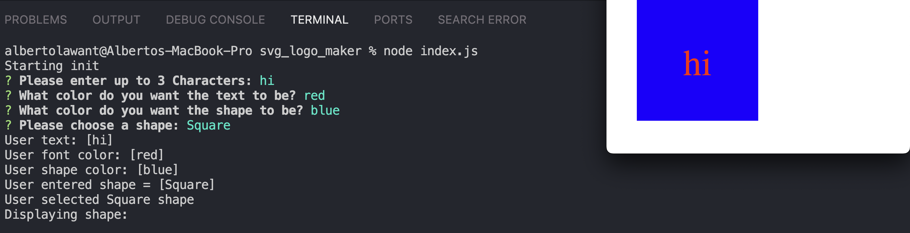

# svg_logo_maker

# Description

This is an Svg logo maker. It is a simple application that allows users to create their own logos.

- For training as well as job application.
- Applying concepts learned in class
- Maximazing learnability 

## Example

## Links

GitHub [Click Here](https://github.com/ParryProgramming)
